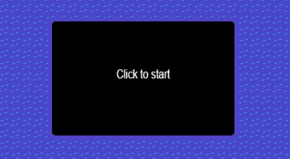

# Reach The Flag
A small game developed as a study project to learn and practice **JavaS Canvas**.

  

This project was created to experiment with the Canvas API and practice concepts such as:

- Drawing images and tiles on a Canvas
- Pixel art rendering
- Creating a tile-based map using a matrix
- Character movement
- Basic collision detection
- Sprite positioning
- Game states and win conditions
- Keyboard input
- Audio and sound effects

The game uses a tileset made of **16×16 pixel tiles**, with the map determining which tile should be drawn at each position.

## Objective

Move the character through the map and reach the flag.

## Art & Music

- **Art:** Made in MS Paint
- **Music:** Created with BeepBox
