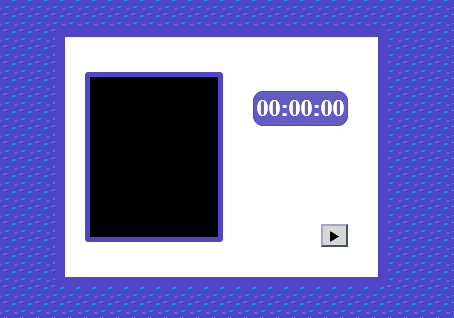

# Reach The Flag

A small game developed as a study project to learn and practice **JavaScript Canvas**.

  

The goal is simple: **reach the flag with your character**.

This project was created to experiment with the Canvas API and practice concepts such as:

- Drawing images and tiles on a Canvas
- Pixel art rendering
- Creating a tile-based map using a matrix
- Character movement and collision detection
- Sprite positioning
- Game states and win conditions
- Custom on-screen controls using a separate Canvas
- Clickable buttons and visual feedback
- A timer to track completion time
- Audio and sound effects

## Gameplay

Use the on-screen directional controls to move your character up, down, left, and right through the map.

Reach the flag to win and see how long it took you to complete the level.

The game also features a Play/Reset button to start a new run or try again.

## Resources

- **Art:** Made in MS Paint
- **Music:** Created with BeepBox

## Purpose

This is a personal study project focused on learning JavaScript Canvas and exploring the fundamentals of 2D game development.

  

